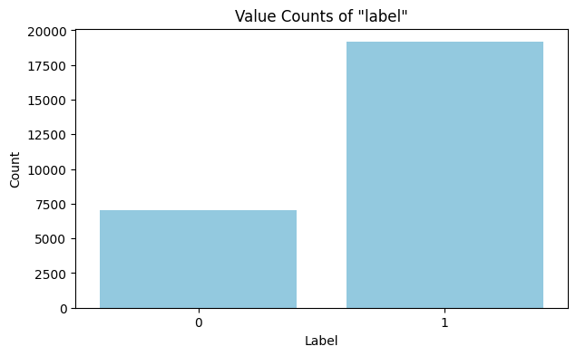

# Sentiment Analysis on the 2024 Elections in Indonesia using Naïve Bayes with SMOTE

## Project Overview
This project performs sentiment analysis on public opinion regarding the 2024 General Elections in Indonesia. This study classifies public sentiment into positive, negative, or neutral categories.

A key focus of this project is addressing **Class Imbalance**. The repository contains two distinct experiments:
1.  **Baseline:** Naïve Bayes classification on the raw dataset.
2.  **Improved:** Naïve Bayes classification using **SMOTE (Synthetic Minority Over-sampling Technique)** to balance the dataset and improve model sensitivity.



## Dataset
* **File:** `data/DatasetSA.csv`
* **Content:** Tweets related to the 2024 Indonesian Presidential Election.
* **Preprocessing:** The data undergoes cleaning, case folding, tokenization, stopword removal, and stemming before analysis.

## Methodology
The project follows a standard text mining pipeline:
1.  **Text Preprocessing:** Cleaning noise, removing punctuation, and normalizing text.
2.  **Feature Extraction:** Converting text to numerical vectors (likely TF-IDF or Bag of Words).
3.  **Resampling (SMOTE):** Generating synthetic data points for minority classes to prevent model bias.
4.  **Classification:** Using the Naïve Bayes algorithm.
5.  **Evaluation:** Comparing Accuracy, Precision, Recall, and F1-Score between the two approaches.

## Installation & Usage

1.  **Clone the repository**
    ```bash
    git clone [https://github.com/citakamaliaa/id-election-sa-naive-bayes.git](https://github.com/citakamaliaa/id-election-sa-naive-bayes.git)
    cd id-election-sa-naive-bayes
    ```

2.  **Install dependencies**
    ```bash
    pip install -r requirements.txt
    ```

3.  **Run the Notebooks**
    You can run the notebooks to see the comparison:
    * `notebooks/Without_SMOTE_Sentiment_Analysis.ipynb`: Baseline model performance.
    * `notebooks/SMOTE_Sentiment_Analysis.ipynb`: Model performance with balanced data.

## Results
The table below compares the performance of the Naïve Bayes classifier before and after applying SMOTE. Without SMOTE, the model struggled to identify Class 0 (Recall: 0.37). After applying SMOTE, the model's ability to detect Class 0 improved drastically (Recall: 0.87), resulting in a more balanced and accurate system.

| Metric | Without SMOTE | With SMOTE |
| :--- | :---: | :---: |
| **Overall Accuracy** | **79%** | **87%** |
| **Macro Avg F1-Score** | **0.68** | **0.87** |
| | | |
| **Class 0 (Minority)** | | |
| Precision | 0.72 | 0.87 |
| Recall | 0.37 | 0.87 |
| F1-Score | 0.49 | 0.87 |
| | | |
| **Class 1 (Majority)** | | |
| Precision | 0.80 | 0.88 |
| Recall | 0.95 | 0.88 |
| F1-Score | 0.87 | 0.88 |
